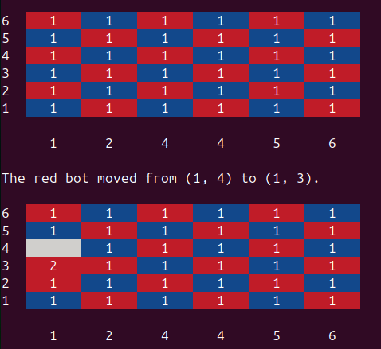
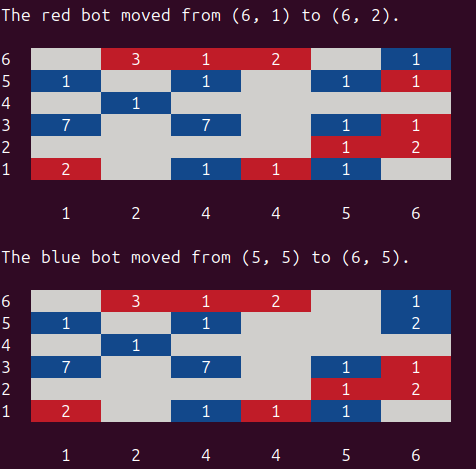
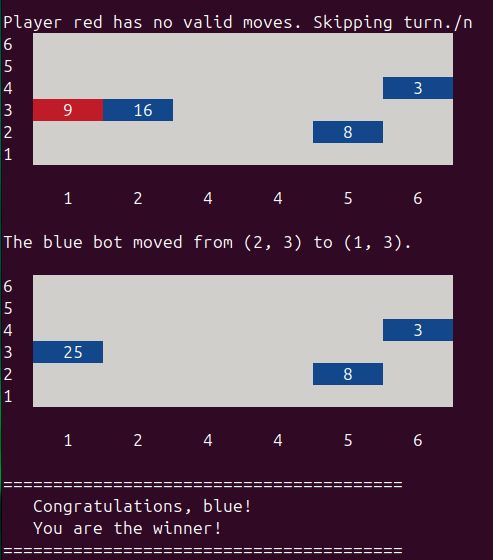
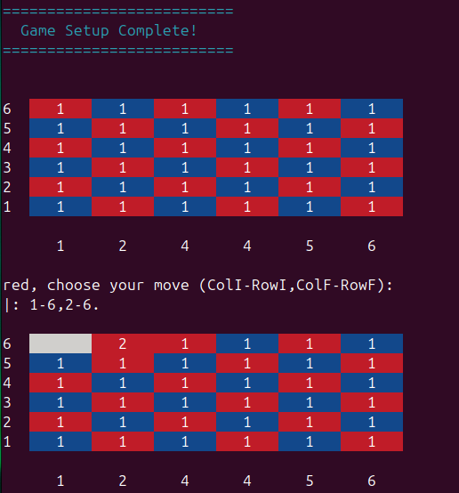

# PFL_TP2_T06_Anaash_06

The game we chose was Anaash.

### Group and Contributions
- Eduardo Narciso Rodrigues Santos, up202207521 - 37.5% (
- Pedro dos Santos Sousa Pedro, up202206961 - 37.5% (
- Renata Soares Bandeira Simão, up202205124 - 25% (menu.pl e README)

### Installation and Execution
Execute o comando 'sicstus -l game.pl' e inicie o jogo com 'play.'.

### Description of Anaash
Anaash is a two-player abstract strategy game created by Mark Steere in February 2021. It is played on a 6x6, 8x8, or larger checkerboard, which starts fully populated with a checkered pattern of red and blue checkers. Each checker stack consists of one piece, known as a "singleton." Players take turns moving and combining stacks, aiming to outmaneuver their opponent through strategic positioning and control of the board.

### Objective
The goal of the game is to capture all enemy checkers. Draws are not possible.

### Gameplay
Players alternate turns, starting with Red, making one move per turn. If no valid move exists, the player skips their turn. The goal is to capture all opponent's pieces or have all remaining pieces belong to one player.

### Types of Moves
#### Positional Moves:
- A stack is moved orthogonally (horizontally or vertically) to an adjacent unoccupied square.
- The move must reduce the Manhattan distance to the stack's nearest neighbor, regardless of color or height.
- Only stacks with no orthogonal neighbors are eligible for positional moves.

#### Stacking Moves:
- A stack is moved onto an orthogonally adjacent friendly stack of equal or greater height.
- The resulting stack's size is the sum of the two stacks.

#### Capturing Moves:
- A stack captures an orthogonally adjacent enemy stack of equal or smaller height.
- The capturing stack's size increases by adding the captured stack's size.

### Notable Rules:
- The game always progresses towards one player capturing all the opponent's pieces, making it deterministic with no chance of ties.
- If a player has no valid moves, they must skip their turn.
- An optional rule allows diagonal moves (one per player per turn), which can be enabled during game setup.
- The game ends when:
    - All remaining pieces belong to one player.
    - Only two stacks remain, and the winner is the player with the largest stack.

#### References
- Game rules source:[ Mark Steere's official rule sheet](https://www.marksteeregames.com/Anaash_rules.pdf)
- Author's website: [marksteeregames.com](http://marksteeregames.com/)

### Considerations for game extensions
Our game has 3 different board sizes, such as 4x4, 6x6 and 8x8, and in the 3 different sizes, there are no additional considerations to take into account during the game. The size of the board does not change the way you play. In addition, we have implemented an optional rule in which all players have the chance to play once diagonally. There is no variety of rules when it comes to the players' gaming experience.

### Game Logic

#### Game Configuration Representation
The game configuration represents the initial settings required to set up the game before it starts. This includes:
1. Game Type (GameType): Indicates whether the game is Human vs Human (h_h), Human vs Bot (h_pc), Bot vs Human (pc_h), or Bot vs Bot (pc_pc).
   - Example: h_pc means a human player will play against a bot.
2. Board Size (BoardSize): The size of the board, which can be 4x4, 6x6, or 8x8.
    - Example: 6 represents a 6x6 board.
3. Difficulty (Difficulty): Represents the difficulty level for bots, which can be easy, medium, or hard. For Bot vs Bot games, it includes separate difficulties for each bot (e.g., easy-hard).
4. Diagonal Rule (DiagonalRule): Indicates whether diagonal moves are allowed ([1, 1]) or not ([0, 0]).

#### Internal Representation
The configuration is represented as a tuple: (GameType, BoardSize, Difficulty, DiagonalRule)
- Example: (h_pc, 6, easy, [0, 0])

##### Usage by initial_state/2
The initial_state/2 predicate uses the game configuration to initialize the game state:
1. It generates the board using the board(BoardSize, Board) predicate from board.pl.
2. It maps the game type and difficulty to their internal representations using map_game_type and map_difficulty.
3. The initialized state (gameState) includes the board, the first player (red), and other settings derived from the configuration.

### Internal Game State Representation
The game state represents the current state of the game during gameplay. It includes:
1. Board Size (BoardSize): The dimensions of the board.
2. Board (Board): A list of lists representing the current state of the board. Each cell contains:
   - empty: Indicates an empty cell.
    - Color-Size: Represents a piece, where Color is either red or blue, and Size is the stack size.
    - Example of an initial 4x4 board:
[[blue-1, red-1, blue-1, red-1],
 [red-1, blue-1, red-1, blue-1],
 [blue-1, red-1, blue-1, red-1],
 [red-1, blue-1, red-1, blue-1]]
3. Player (Player): The current player (red or blue).
4. Game Type (GameType): Indicates whether it's Human vs Human, Human vs Bot, etc.
5. Player Types (RedType, BlueType): Indicates whether each player is a human (human) or a bot (bot).
6. Bot Levels (Level): Represents the difficulty levels for bots.
7. Diagonal Rule (DiagonalRule): Indicates whether diagonal moves are allowed.

##### Examples
- Initial State:
gameState(4, [[blue-1, red-1, blue-1, red-1],
              [red-1, blue-1, red-1, blue-1],
              [blue-1, red-1, blue-1, red-1],
              [red-1, blue-1, red-1, blue-1]],
         red, h_h, human, human, 0, [0, 0])
  
- Intermediate State (after some moves):
gameState(4, [[blue-2, red-1, empty, empty],
              [empty, blue-1, red-1, blue-1],
              [blue-1, red-1, blue-1, red-1],
              [red-1, blue-1, empty, red-1]],
         blue, h_pc, human, bot, 1, [0, 0])
  
- Final State (Blue wins):
gameState(4, [[empty, empty, empty, empty],
              [empty, empty, empty, empty],
              [empty, blue-5, empty, empty],
              [empty, empty, empty, empty]],
         red, h_h, human, human, 0, [0, 0])
  
### Move Representation
A move in the game is represented as a pair of coordinates indicating the starting and ending positions: (RowStart-ColStart, RowEnd-ColEnd)
- RowStart-ColStart: The starting position of the piece.
- RowEnd-ColEnd: The destination position.
##### Example
- A move from (1, 1) to (2, 2) is represented as: (1-1, 2-2)

##### Usage by move/3
1. The move/3 predicate takes:
   - The current game state (GameState).
    - The move to be executed (Move).
    - The resulting game state after the move (NewGameState).
2. It performs the following:
    - Validates the move using valid_move.
    - Updates the board by moving, stacking, or capturing pieces.
    - Changes the current player (next_player).

### User Interaction
##### Game Menu System
The menu system, implemented in menu.pl, guides the user through the configuration process:
1. Game Type: Players choose the mode of the game (e.g., Human vs Bot).
2. Board Size: Players select the size of the board (4x4, 6x6, or 8x8).
3. Difficulty: Players configure the difficulty level for bots.
4. Diagonal Rule: Players enable or disable diagonal moves.

##### Input Validation
1. Input validation is handled using utility predicates such as:
    - read_menu_option: Ensures input is within valid menu options.
    - read_number: Reads and validates numerical input.
    - Example: Choosing a difficulty level ensures the input is within the range [1, 3].
2. Move Input:
    - The get_move predicate prompts players for moves, ensuring the input follows the correct format (RowStart-ColStart, RowEnd-ColEnd).
    - Invalid moves are rejected, and the player is prompted again:
"?- get_move(red, Move).
Red, choose your move (ColI-RowI,ColF-RowF):
Invalid input. Please try again."

### Additional Work - Minimax algorithm (third level of AI)
We implemented the Minimax algorithm to predict the best move for the current player by simulating all possible moves and their outcomes. It first checks if the game is over or if the search depth has reached zero. If so, it evaluates the current game state using minimax_value/2, which calculates a score based on the total stack sizes of both players, using count_pieces/3. For each valid move, it simulates the result with simulate_move1/3 and recursively evaluates the opponent’s best response. The score for each move combines this recursive evaluation with a heuristic (evaluate_move/4) to prioritize moves like captures and stackings. Finally, it selects the best move using select_best/3, maximizing scores for red and minimizing for blue, with ties broken randomly. This allows the AI to play strategically, optimizing its decisions through a balance of depth exploration and heuristic evaluation.

### Images ilustrating the game
 Image 1: Initial game state
 Image 2: Intermediate game state
 Image 3: Final game state
 Image 4: Interaction with the game

### Conclusions
If we had more time, we would have implemented diagonal moves for bots to enhance consistency and optimized the game's performance by using tail recursion to reduce computational complexity and improve efficiency.

### Bibliography
- Game rules source:[ Mark Steere's official rule sheet](https://www.marksteeregames.com/Anaash_rules.pdf)
- Author's website: [marksteeregames.com](http://marksteeregames.com/)
- [SICStus Prolog](https://www.swi-prolog.org/)
- [Geeks for geeks - minimax algorithm](https://www.geeksforgeeks.org/minimax-algorithm-in-game-theory-set-1-introduction/)
- [Video - minimax algortihm](https://www.youtube.com/watch?v=l-hh51ncgDI)
- [SICStus Manual](https://sicstus.sics.se/sicstus/docs/latest4/pdf/sicstus.pdf)
